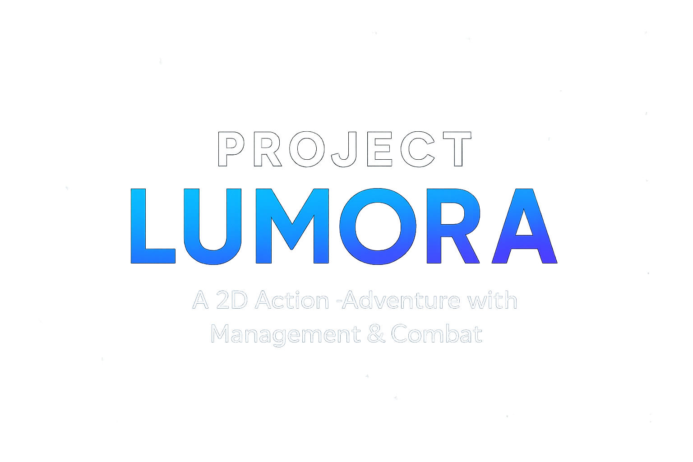
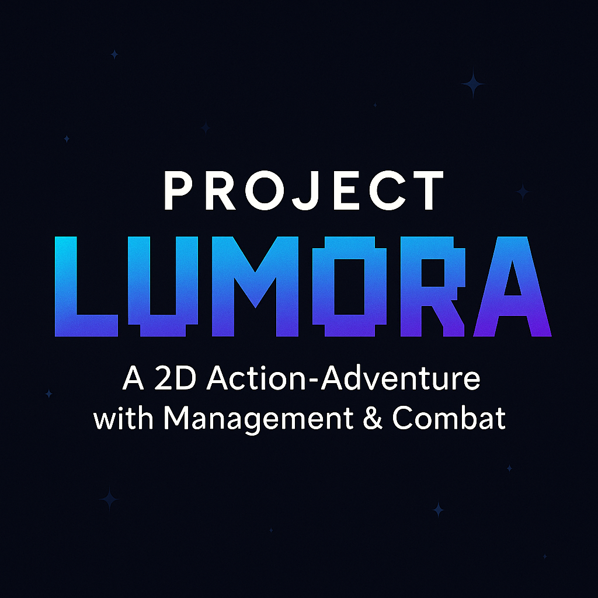

  

  

<h1 align="center">🌌 Project Lumora</h1>

# 🌌 Project Lumora

**Project Lumora**, Godot 4 ile geliştirilen, yönetim ve savaş mekaniğini birleştiren bir 2D aksiyon-macera oyunudur.  
Oyuncular kaynak toplayacak, eşyalar üretecek, adalarını geliştirecek ve düşman kabilelerle savaşırken hayatta kalmaya çalışacak.  

---

## ✨ Özellikler (Planned Features)

- 🧙 **Karakter gelişimi**: Seviye atlama, yetenek ve buff sistemi  
- ⚔️ **Hızlı tempolu savaş**: Çeşitli düşman tipleri, boss savaşları, stat efektleri  
- 🌍 **Dinamik dünya**: Biçim değiştiren biyomlar, gündüz/gece döngüsü, hava durumu  
- 📦 **Envanter ve crafting**: Kaynak toplama, tarifler, ekipman ve üretim istasyonları  
- 🤖 **NPC işçiler ve savaşçılar**: Oyuncuya yardım eden veya bağımsız çalışan karakterler  
- 🏝️ **Keşif & genişleme**: Prosedürel adalar, zindanlar, gizemli bölgeler  
- 💾 **Kayıt sistemi**: Profil ve ilerleme kaydetme / yükleme

---

## 🛠️ Teknolojiler

- 🎮 **Game Engine**: [Godot 4.4](https://godotengine.org/)  
- 📜 **Kodlama**: GDScript  
- 🎨 **Görseller**: Pixel Art (Aseprite pipeline)  
- 🔊 **Ses/Müzik**: OGG / WAV formatları (Git LFS ile yönetiliyor)  

---

## 📂 Klasör Yapısı (özet)
project-lumora/
├─ assets/ # Fontlar, sprite’lar, sesler, shaderler
├─ autoload/ # Global singleton scriptler (Game, Save, AudioBus)
├─ data/ # Item, recipe, düşman ve loot tabloları
├─ scenes/ # Oyunun sahneleri (player, enemies, UI, world)
├─ scripts/ # Sistem mantıkları (combat, AI, inventory, crafting)
├─ ui_theme/ # Theme.tres ve UI stilleri
├─ tests/ # Testler
└─ tools/ # Editor ve dışa aktarma araçları
